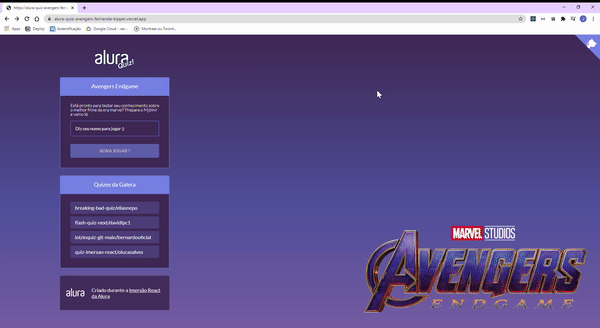

<h1 align="center">Alura Quiz - versão Avengers Game </h1>

<p align="center">
 <a href="#project">Projeto</a> •
 <a href="#tech">Tecnologias</a> • 
 <a href="#clone">Clone</a> • 
 <a href="#license">License</a>
</p>

<h2 id="project" >Talk It!</h2>

O projeto consiste em uma aplicação web, um quiz de perguntas e respostas. Esse projeto foi desenvolvido durante a Imersão React da Alura com Next JS. O tema do quiz era de livre escolha, poderíamos utilizar o Layout base ou escolher nosso background e paleta de cores - escolhi a segunda opção. Construímos o quiz desde o zero, passando por vários conceitos importante do mundo React e Next JS, como Serverless functions.

<h3 align="center"><a href="https://alura-quiz-avengers.fernanda-kipper.vercel.app/">💻 Visite clicando aqui</a></h3>

<p align="center">
  
</p>

<h2 id="tech" >Tecnologias</h2>

- Next JS
- React JS
- Styled Components
- JavaScript
- HTML e CSS
- Eslint - padronização de código
- Framer Motion - animações

<h2 id="clone" >Clone</h2>


Para rodar o Quiz localmente em modo de desenvolvimento você deve:

```
git clone https://github.com/Fernanda-Kipper/Alura-Quiz-NextJS.git project_name
cd project_name
npm install
npm run-script dev
# Acesse o localhost
http://localhost:3000/
```
No local de npm você pode utilizar o package manager de sua preferência

<h2 id="license">Licença</h2>

Esse projeto está sob a licença [MIT](LICENSE)

